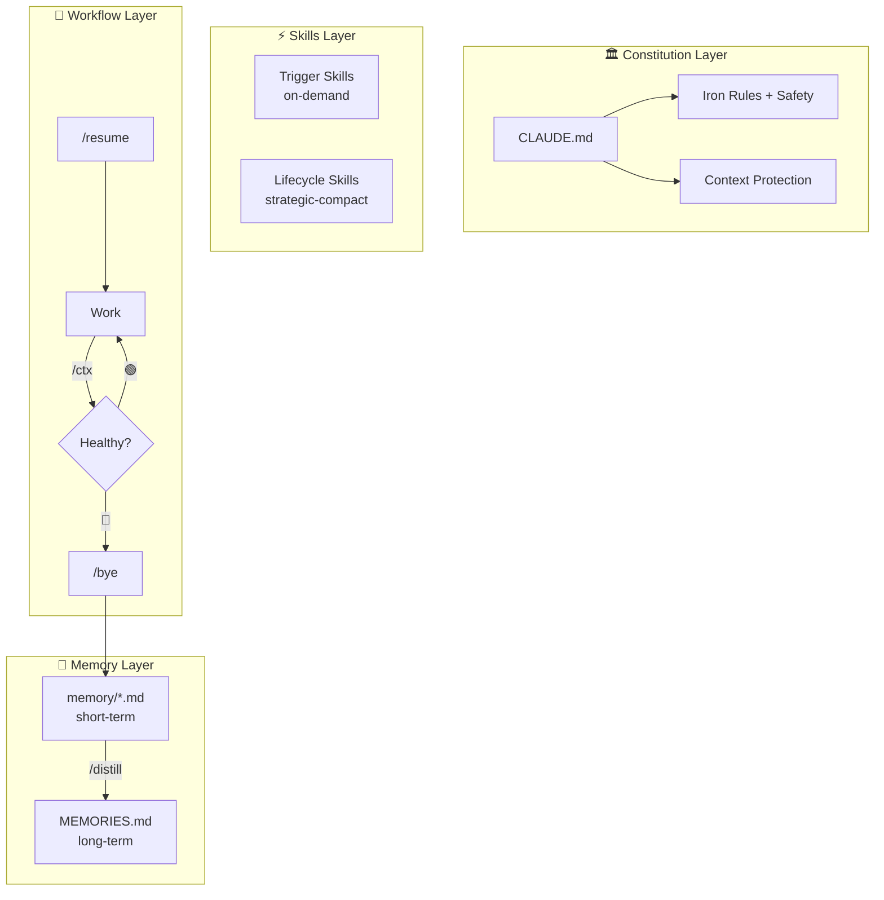

<p align="center">
  
</p>

# 🎭 MUSE

**Memory-Unified Skills & Execution**

<p align="center">

[](https://github.com/myths-labs/muse/blob/main/LICENSE)
[](https://github.com/myths-labs/muse/blob/main/CHANGELOG.md)
[](https://github.com/myths-labs/muse)
[](#)
[](#)

</p>

<p align="center">

[](https://x.com/MythsLabs)
[](https://linkedin.com/company/MythsLabs)
[](https://github.com/myths-labs)
[](https://x.com/sunshiningday)

</p>

> *The nine Muses of Greek mythology were daughters of **Mnemosyne** — the Titaness of Memory. They transformed their mother's gift of total recall into mastery of the arts and sciences.*
>
> *MUSE inherits this lineage. It ensures no insight is lost across AI conversations, transforming raw session data into structured knowledge that drives execution.*

MUSE is a pure-Markdown operating system for AI pair programming. Through constitutions, memory layers, skills, and execution workflows, it enables **lossless context management** across AI coding conversations.

Inspired by the [LCM (Lossless Context Management)](https://papers.voltropy.com/LCM) paper + [lossless-claw](https://github.com/Martian-Engineering/lossless-claw) plugin. MUSE implements LCM's core design principles using **pure Markdown SOPs** — zero code dependencies.

[📖 中文文档 / Chinese Docs](./README_CN.md)

---

## ✨ Why MUSE?

**Problem**: AI coding assistants have context window limits. Long conversations forget early content. New conversations start from scratch. The same mistakes are made twice.

**Solution**: MUSE doesn't change the AI — it wraps it with a **document protocol** that lets it manage its own memory, restore its own context, and save critical info before compression.

| Without MUSE | With MUSE |
|---------|---------|
| AI forgets early context in long conversations | Pre/Post Compaction protocols preserve critical info |
| New conversations need manual context setup | `/resume` auto-assembles context in 5 steps |
| Forget to save progress when ending | `/bye` zero-input one-click wrap-up |
| Cross-day tasks lose continuity | `grep memory/` auto-searches history |
| Same mistakes repeated | `/distill` distills lessons to long-term memory |

**Works with**: Claude Code, Cursor, Windsurf, or any AI tool that supports system prompts / project rules.

---

## 🚀 Quick Start (5 minutes)

### Option A: Interactive Setup (Recommended)

```bash
# Clone MUSE
git clone https://github.com/myths-labs/muse.git

# Run interactive setup — configures language, model, and preferences
cd muse && ./setup.sh
```

The setup wizard will ask for your language, AI model, and docs preferences, then configure everything automatically.

### Option B: Manual Setup

```bash
# Clone MUSE
git clone https://github.com/myths-labs/muse.git

# Copy templates to your project
cp muse/templates/CLAUDE.md your-project/CLAUDE.md
cp muse/templates/USER.md your-project/USER.md
cp muse/templates/MEMORIES.md your-project/MEMORIES.md
mkdir -p your-project/memory your-project/.muse

# Copy skills & workflows
cp -r muse/skills your-project/.agent/skills
cp -r muse/workflows your-project/.agent/workflows

# Add MUSE entries to your .gitignore
cat muse/templates/.gitignore-template >> your-project/.gitignore
```

Your project should look like:

```
your-project/
├── CLAUDE.md              # 📜 Constitution (AI iron rules)
├── USER.md                # 👤 Your preferences
├── MEMORIES.md            # 🧠 Long-term lessons
├── .muse/                 # 🎭 Role states
│   └── build.md           # ⚙️ Dev execution
├── memory/                # Short-term memory
│   └── YYYY-MM-DD.md
├── .agent/
│   ├── skills/            # Skills library
│   └── workflows/         # resume/bye/sync/distill/ctx
└── [your code]
```

### 2. Customize `CLAUDE.md`

This is MUSE's core — the AI's "constitution". Edit to match your project:

```markdown
# Iron Rules
1. All communication in [your language]
2. Check Skills before ANY task
3. Large files: view ≤300 lines at a time
4. Context ≥ 80%: immediately exit
5. Verify before claiming done
6. End conversations with /bye
```

### 3. Start using

```
You: /resume           ← AI reads constitution → reads memory → starts work
     ... work ...
You: /ctx              ← Check if context is enough
     ... continue ...
You: /bye              ← One-click wrap-up, auto-save
```

---

## 🏛 Architecture



### LCM Concept Mapping

| LCM Concept | MUSE Implementation | Description |
|---------|----------|------|
| SQLite persistence | `memory/` + `MEMORIES.md` | Markdown as database |
| Leaf nodes | `memory/YYYY-MM-DD.md` | Daily conversation snapshots |
| Condensed nodes | `MEMORIES.md` | Cross-day distilled lessons |
| Condensation | `/distill` | Leaf → long-term memory |
| Assembler | `/resume` | Context assembly |
| lcm_grep | `grep_search memory/` | Deep history search |
| compact:before | Pre-Compaction Protocol | Save before compress |
| contextThreshold | `/ctx` 80% red line | Auto health check |

---

## 📖 Commands

| Command | Description | Input |
|---------|------------|:-----:|
| `/start` | First-time setup — configures project, roles, language | None (interactive) |
| `/resume [scope]` | Boot — restore context & start work | `build`, `growth`, etc. |
| `/settings` | Change language, AI model, or preferences | Subcommand (optional) |
| `/ctx` | Context health check (🟢🟡🔴) | None needed |
| `/bye` | One-click wrap-up — save, sync, archive | None needed |
| `/distill` | Condense `memory/` → `MEMORIES.md` | None needed |
| `/sync [direction]` | Cross-file sync in multi-role setup | Direction (optional) |
| `/sync receive` | Pull updates from other roles mid-conversation | None needed |
| `/resume crash` | Recover from context blowout | None needed |

### Defensive Auto-Save (L0 Defense)

MUSE doesn't wait for context to run out. Every **10 interaction rounds**, it silently updates `memory/CRASH_CONTEXT.md`. If a sudden blowout occurs, at most 10 rounds of progress are lost.

| Layer | Trigger | Reliability |
|:----:|------|:------:|
| L0 | Every 10 rounds (silent) | ⭐⭐⭐ |
| L1 | 🔴 context detection | ⭐⭐ |
| L2 | `/resume crash` scans `convo/` | ⭐ |

### Auto-Distill Detection

Every `/bye` automatically checks `memory/` accumulation. Reminds you to `/distill` when:
- ≥ 7 days of un-distilled logs
- ≥ 5 new log files since last distill
- ≥ 15 total files and never distilled

---

## 🧩 Skill System

### Loading Behavior

| Type | When Loaded | Examples |
|------|---------|------|
| **Always-on** | Every turn automatically | `CLAUDE.md` iron rules, Safety |
| **Trigger** | When task matches | `git-commit`, `systematic-debugging` |
| **Lifecycle** | On specific events | `strategic-compact` (compression), `verification` (completion) |

### Tier Classification

| Tier | Description | Ships with MUSE? | Examples |
|:----:|------|:-------------:|------|
| **🏛 Core** | Required for MUSE to function | ✅ Built-in | `context-health-check`, `strategic-compact`, `verification-before-completion`, `using-superpowers` |
| **🔧 Toolkit** | General dev tools, recommended | ✅ Included | `git-commit`, `systematic-debugging`, `security-review`, `tdd-workflow`, `frontend-design`, `ui-ux-pro-max`, +19 more |
| **🎯 Domain** | User-created, domain-specific | ❌ Private | Your own custom skills |

### Skill Lifecycle

```
memory/ lessons repeat → /distill finds pattern → write to MEMORIES.md
→ appears ≥3 times → upgrade to CLAUDE.md constitution
→ methodology is generic enough → create new Skill
→ useful across projects → contribute to MUSE Toolkit
```

---

## 📁 Directory Convention

### Standard Project Structure

```
project/
├── CLAUDE.md              # 📜 Constitution
├── README.md              # Public README
├── LICENSE                # License
├── USER.md                # Preferences (private)
├── MEMORIES.md            # Long-term lessons (private)
├── assets/                # 🎨 Project assets (public)
│   ├── logo.png           # Project logo
│   ├── banner.png         # README/social banner
│   ├── screenshots/       # App screenshots
│   ├── diagrams/          # Architecture diagrams
│   └── social/            # Social media assets (OG images, previews)
├── .muse/                 # 🎭 Role states (private)
│   ├── build.md / qa.md / growth.md / ...
├── memory/                # Short-term memory (private)
│   └── YYYY-MM-DD.md
├── convo/                 # Conversation archives (private)
│   └── YYMMDD/
├── docs/                  # Documentation
│   ├── [public docs]      # → git push ✅
│   └── internal/          # Strategy/fundraising (private)
├── src/ | packages/       # Source code
└── .agent/                # Skills + Workflows (private)
```

### Naming Conventions

| Category | Pattern | Example |
|------|------|------|
| Memory logs | `YYYY-MM-DD.md` | `2026-03-12.md` |
| Conversations | `YYMMDD-NN-desc.md` | `260312-02-muse_setup.md` |
| Crash archives | `+_CRASH` suffix | `260312-05-debug_CRASH.md` |
| .muse roles | `[role].md` lowercase | `build.md`, `qa.md` |

### Assets Convention

| Subdirectory | Purpose | Naming Pattern |
|-------------|---------|---------------|
| `assets/` (root) | Logo, banner, favicon | `logo.png`, `banner.png`, `favicon.ico` |
| `assets/screenshots/` | App/feature screenshots | `feature-name.png` or `YYMMDD-feature.png` |
| `assets/diagrams/` | Architecture, flow charts | `component-name-diagram.png` |
| `assets/social/` | OG images, social cards | `og-default.png`, `x-card.png` |

> **Tip**: Keep `assets/` in git (public). Large video files (>10MB) should use Git LFS or external hosting.

---

## 🔧 Customization

### Minimal Setup (Personal Project)

Just 3 things:
- `CLAUDE.md` — Constitution (required)
- `memory/` — Short-term memory (required)
- `MEMORIES.md` — Long-term memory (recommended)

### Standard Setup (Indie Developer)

Add the role system:
- `.muse/build.md` — Dev state
- `.muse/qa.md` — Quality verification
- `USER.md` — Personal preferences

### Full Setup (Team / Multi-Project)

Add GM + all roles + sync:
- `.muse/strategy.md` — Strategy (global, one per workspace)
- `.muse/gm.md` — Project GM (project-level CEO)
- `.muse/build.md` + `qa.md` + `growth.md` + `ops.md` + `research.md` + `fundraise.md`
- `/sync` workflow — Cross-role sync

---

## 🤔 FAQ

**Q: Does MUSE require installation?**
No. MUSE is pure Markdown files. Copy them to your project and you're ready. Zero dependencies.

**Q: Which AI tools does it support?**
Any tool that supports system prompts / project rules: Claude Code (`CLAUDE.md`), Cursor (`.cursorrules`), Windsurf, Copilot, etc.

**Q: How is this different from lossless-claw?**
lossless-claw is a code plugin (SQLite + DAG + sub-agents) that requires the OpenClaw runtime. MUSE is pure Markdown SOPs, works with any AI tool, zero dependencies. Same principles, different implementation.

**Q: What if memory/ files pile up?**
Archive files older than 30 days to `memory/archive/`. Use `/distill` to extract key lessons into `MEMORIES.md` first, then safely archive the originals.

## 💬 Follow Us

- 🌐 GitHub: [Myths Labs](https://github.com/myths-labs)
- 🐦 X (Twitter): [@MythsLabs](https://x.com/MythsLabs)
- 💼 LinkedIn: [Myths Labs](https://linkedin.com/company/MythsLabs)
- 👤 Creator: [@SunshiningDay](https://x.com/sunshiningday) — indie dev, solo-building MUSE

---

## 🙏 Credits

- [LCM Paper](https://papers.voltropy.com/LCM) by Ehrlich & Blackman — Theoretical foundation for lossless context management
- [lossless-claw](https://github.com/Martian-Engineering/lossless-claw) by Martian Engineering — OpenClaw implementation of LCM
- Greek Mythology — Mnemosyne and her nine Muses, eternal symbols of memory and creation

---

## 📜 License

MIT © [Myths Labs](https://github.com/myths-labs)

---

<p align="center">
  Built with 🎭 by <a href="https://github.com/myths-labs">Myths Labs</a> — Solo-developed by <a href="https://github.com/jc-myths">JC</a>
</p>

<p align="center">
  <i>MUSE v2.7.2</i>
</p>

