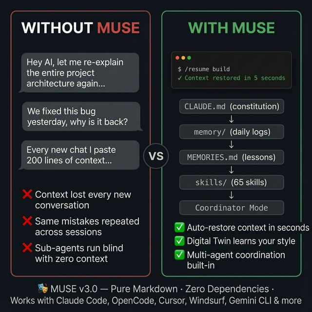
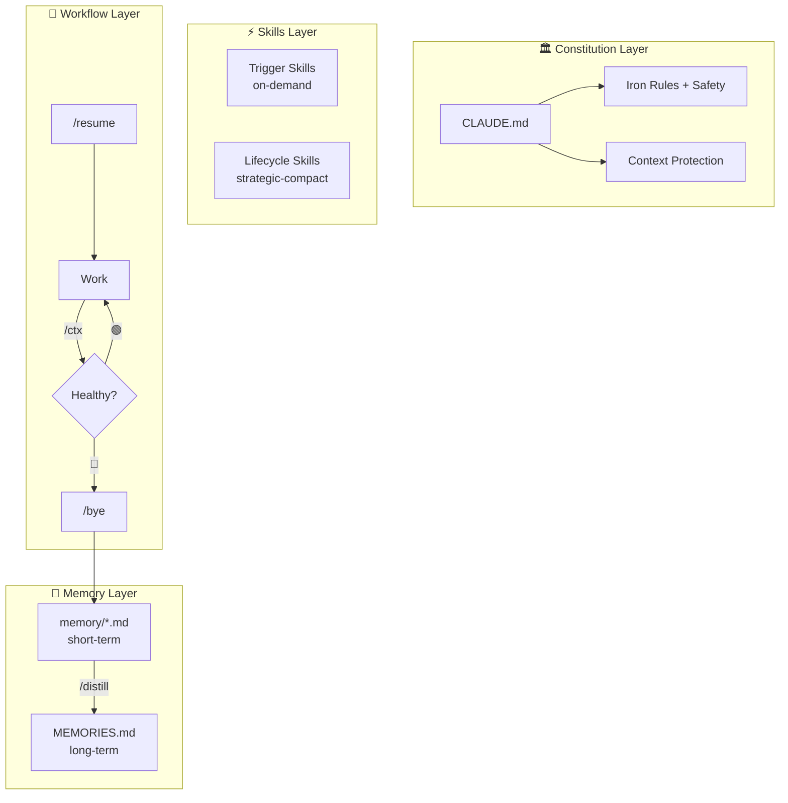

<p align="center">
  
</p>

# 🎭 MUSE

**The AI Coding Governance System — Roles, Memory, Skills, in Plain Markdown**

<p align="center">

[](https://github.com/myths-labs/muse/blob/main/LICENSE)
[](https://github.com/myths-labs/muse/blob/main/CHANGELOG.md)
[](https://github.com/myths-labs/muse)
[](#)
[](#)

</p>

<p align="center">

[](https://muse.mythslabs.ai)
[](https://x.com/MythsLabs)
[](https://linkedin.com/company/MythsLabs)
[](https://github.com/myths-labs)
[](https://x.com/sunshiningday)

</p>

> *The nine Muses of Greek mythology were daughters of **Mnemosyne** — the Titaness of Memory. They transformed their mother's gift of total recall into mastery of the arts and sciences.*
>
> *MUSE inherits this lineage. It ensures no insight is lost across AI conversations, transforming raw session data into structured knowledge that drives execution.*

MUSE is a pure-Markdown governance system for AI pair programming. It goes beyond format specs (like AGENTS.md or .cursorrules) by providing a **full system** — role isolation, persistent memory, 57 skills, cross-role directives, and visual dashboards — all with zero code dependencies.

```
┌─────────────────────────────────────────────────────┐
│ L3  Memory Infrastructure   mem0 · MemOS · memsearch│  ← MUSE doesn't compete here
├─────────────────────────────────────────────────────┤
│ L2  Governance System       🎭 MUSE                 │  ← Only player at this layer
│     Roles · Memory · Skills · Directives · Dashboard│
├─────────────────────────────────────────────────────┤
│ L1  Workflow Kits           Spec Kit · sudocode      │  ← MUSE covers this + more
├─────────────────────────────────────────────────────┤
│ L0  Format Specs            AGENTS.md · .cursorrules │  ← MUSE is compatible
└─────────────────────────────────────────────────────┘
```

> **AGENTS.md defines the format. MUSE builds the system on top of it.**

Inspired by [LCM (Lossless Context Management)](https://papers.voltropy.com/LCM) + [lossless-claw](https://github.com/Martian-Engineering/lossless-claw). MUSE implements LCM's core design principles using **pure Markdown SOPs** — zero code dependencies.

[📖 中文文档 / Chinese Docs](./README_CN.md)

---

## ✨ Why MUSE?

**Problem**: AI coding assistants have context window limits. Format specs like `.cursorrules` or `AGENTS.md` give your AI instructions — but they can't manage **memory**, **roles**, or **cross-session knowledge**. Long conversations forget early content. New conversations start from scratch.

**Solution**: MUSE wraps your AI with a **governance protocol** — role isolation, persistent dual-layer memory, 57 reusable skills, cross-role directive queue, and visual dashboards. All in plain Markdown.

| Without MUSE | With MUSE |
|---------|---------|
| AI forgets early context in long conversations | Pre/Post Compaction protocols preserve critical info |
| New conversations need manual context setup | `/resume` auto-assembles context in 5 steps |
| One persona for all tasks | Role isolation: build / QA / growth each see only their context |
| No cross-session memory | Dual-layer: `memory/` (short-term) + `MEMORIES.md` (long-term) |
| Same mistakes repeated | `/distill` distills lessons → `/search` finds them later |
| No visibility into project health | Web Dashboard + VS Code Extension |

> 🎯 **Benchmark** (run `./scripts/benchmark.sh` on your own project):
> - `/resume` loads **16.9× more context** than a bare `.cursorrules` cold start
> - **15/15** governance features vs **0/15** for format-spec-only setups
> - 344 lines of accumulated project knowledge vs 0 retained across sessions

<p align="center">
  
</p>

<p align="center">
  
</p>

**Works with**: Claude Code · OpenClaw · Cursor · Windsurf · Gemini CLI · Codex CLI — or any AI tool that supports system prompts.

| Tool | Install Command | Format |
|------|----------------|--------|
| Claude Code / OpenClaw | `./scripts/install.sh --tool claude` | `.agent/skills/` + `CLAUDE.md` |
| Cursor | `./scripts/install.sh --tool cursor` | `.cursor/rules/*.mdc` |
| Windsurf | `./scripts/install.sh --tool windsurf` | `.windsurf/rules/*.md` |
| Gemini CLI | `./scripts/install.sh --tool gemini` | `.gemini/skills/` + `GEMINI.md` |
| Codex CLI | `./scripts/install.sh --tool codex` | `AGENTS.md` (single file) |

**Recommended companion**: [**nah**](https://github.com/manuelscgipper/nah) — context-aware permission guard for Claude Code. Deterministic classifier that auto-allows safe operations, asks for ambiguous ones, and blocks dangerous patterns (e.g. `curl | bash`). Eliminates permission fatigue without sacrificing safety. `pip install nah && nah install`

---

## 🚀 Quick Start (5 minutes)

### Option A: Interactive Setup (Recommended)

```bash
# Clone MUSE
git clone https://github.com/myths-labs/muse.git

# Run interactive setup — configures language, model, and preferences
cd muse && ./setup.sh
```

The setup wizard will ask for your language, AI model, and docs preferences, then configure everything automatically.

### Option B: Multi-Tool Install (Cursor / Windsurf / Gemini CLI / Codex CLI)

```bash
# Clone MUSE
git clone https://github.com/myths-labs/muse.git

# Install for your tool (auto-converts to the right format)
cd muse && ./scripts/install.sh --tool cursor --target /path/to/your-project

# Or auto-detect installed tools
./scripts/install.sh --target /path/to/your-project
```

Supported: `claude`, `openclaw`, `cursor`, `windsurf`, `gemini`, `codex`, or `all`.

### Option C: Manual Setup

```bash
# Clone MUSE
git clone https://github.com/myths-labs/muse.git

# Copy templates to your project
cp muse/templates/CLAUDE.md your-project/CLAUDE.md
cp muse/templates/USER.md your-project/USER.md
cp muse/templates/MEMORIES.md your-project/MEMORIES.md
mkdir -p your-project/memory your-project/.muse

# Copy skills & workflows
cp -r muse/skills your-project/.agent/skills
cp -r muse/workflows your-project/.agent/workflows

# Add MUSE entries to your .gitignore
cat muse/templates/.gitignore-template >> your-project/.gitignore
```

Your project should look like:

```
your-project/
├── CLAUDE.md              # 📜 Constitution (AI iron rules)
├── USER.md                # 👤 Your preferences
├── MEMORIES.md            # 🧠 Long-term lessons
├── .muse/                 # 🎭 Role states
│   └── build.md           # ⚙️ Dev execution
├── memory/                # Short-term memory
│   └── YYYY-MM-DD.md
├── .agent/
│   ├── skills/            # Skills library
│   └── workflows/         # resume/bye/sync/distill/ctx
└── [your code]
```

### 2. Customize `CLAUDE.md`

This is MUSE's core — the AI's "constitution". Edit to match your project:

```markdown
# Iron Rules
1. All communication in [your language]
2. Check Skills before ANY task
3. Large files: view ≤300 lines at a time
4. Context ≥ 80%: immediately exit
5. Verify before claiming done
6. End conversations with /bye
```

### 3. Start using

```
You: /resume           ← AI reads constitution → reads memory → starts work
     ... work ...
You: /ctx              ← Check if context is enough
     ... continue ...
You: /bye              ← One-click wrap-up, auto-save
```

---

## 🏛 Architecture



### LCM Concept Mapping

| LCM Concept | MUSE Implementation | Description |
|---------|----------|------|
| SQLite persistence | `memory/` + `MEMORIES.md` | Markdown as database |
| Leaf nodes | `memory/YYYY-MM-DD.md` | Daily conversation snapshots |
| Condensed nodes | `MEMORIES.md` | Cross-day distilled lessons |
| Condensation | `/distill` | Leaf → long-term memory |
| Assembler | `/resume` | Context assembly |
| lcm_grep | `./scripts/search.sh` (TF-IDF) | Ranked semantic search |
| compact:before | Pre-Compaction Protocol | Save before compress |
| contextThreshold | `/ctx` 80% red line | Auto health check |

---

## 📖 Commands

| Command | Description | Input |
|---------|------------|:-----:|
| `/start` | First-time setup — configures project, roles, language | None (interactive) |
| `/resume [scope]` | Boot — restore context & start work | `build`, `growth`, etc. |
| `/settings` | Change language, AI model, or preferences | Subcommand (optional) |
| `/ctx` | Context health check (🟢🟡🔴) | None needed |
| `/bye` | One-click wrap-up — save, sync, archive | None needed |
| `/distill` | Condense `memory/` → `MEMORIES.md` | None needed |
| `/search` | TF-IDF search across memory, roles, skills | Query string |
| `/sync [direction]` | Cross-file sync in multi-role setup | Direction (optional) |
| `/sync receive` | Pull updates from other roles mid-conversation | None needed |
| `/resume [project] qa` | Start QA verification (independent from build) | Project name (optional) |
| `/resume crash` | Recover from context blowout | None needed |

### Defensive Auto-Save (L0 Defense)

MUSE doesn't wait for context to run out. Every **10 interaction rounds**, it silently updates `memory/CRASH_CONTEXT.md`. If a sudden blowout occurs, at most 10 rounds of progress are lost.

| Layer | Trigger | Reliability |
|:----:|------|:------:|
| L0 | Every 10 rounds (silent) | ⭐⭐⭐ |
| L1 | 🔴 context detection | ⭐⭐ |
| L2 | `/resume crash` scans `convo/` | ⭐ |

### Auto-Distill Detection

Every `/bye` automatically checks `memory/` accumulation. Reminds you to `/distill` when:
- ≥ 7 days of un-distilled logs
- ≥ 5 new log files since last distill
- ≥ 15 total files and never distilled

---

## 🧩 Skill System

### Loading Behavior

| Type | When Loaded | Examples |
|------|---------|------|
| **Always-on** | Every turn automatically | `CLAUDE.md` iron rules, Safety |
| **Trigger** | When task matches | `git-commit`, `systematic-debugging` |
| **Lifecycle** | On specific events | `strategic-compact` (compression), `verification` (completion) |

### Tier Classification

| Tier | Description | Ships with MUSE? | Examples |
|:----:|------|:-------------:|------|
| **🏛 Core** | Required for MUSE to function | ✅ Built-in | `context-health-check`, `strategic-compact`, `verification-before-completion`, `using-superpowers` |
| **🔧 Toolkit** | General dev tools, recommended | ✅ Included | `git-commit`, `systematic-debugging`, `security-review`, `tdd-workflow`, `frontend-design`, `ui-ux-pro-max`, +19 more |
| **🎯 Domain** | User-created, domain-specific | ❌ Private | Your own custom skills |

### Skill Lifecycle

```
memory/ lessons repeat → /distill finds pattern → write to MEMORIES.md
→ appears ≥3 times → upgrade to CLAUDE.md constitution
→ methodology is generic enough → create new Skill
→ useful across projects → contribute to MUSE Toolkit
```

---

## 📁 Directory Convention

### Standard Project Structure

```
project/
├── CLAUDE.md              # 📜 Constitution
├── README.md              # Public README
├── LICENSE                # License
├── USER.md                # Preferences (private)
├── MEMORIES.md            # Long-term lessons (private)
├── assets/                # 🎨 Project assets (public)
│   ├── logo.png           # Project logo
│   ├── banner.png         # README/social banner
│   ├── screenshots/       # App screenshots
│   ├── diagrams/          # Architecture diagrams
│   └── social/            # Social media assets (OG images, previews)
├── .muse/                 # 🎭 Role states (private)
│   ├── build.md / qa.md / growth.md / ...
├── memory/                # Short-term memory (private)
│   └── YYYY-MM-DD.md
├── convo/                 # Conversation archives (private)
│   └── YYMMDD/
├── docs/                  # Documentation
│   ├── [public docs]      # → git push ✅
│   └── internal/          # Strategy/fundraising (private)
├── src/ | packages/       # Source code
└── .agent/                # Skills + Workflows (private)
```

### Naming Conventions

| Category | Pattern | Example |
|------|------|------|
| Memory logs | `YYYY-MM-DD.md` | `2026-03-12.md` |
| Conversations | `YYMMDD-NN-desc.md` | `260312-02-muse_setup.md` |
| Crash archives | `+_CRASH` suffix | `260312-05-debug_CRASH.md` |
| .muse roles | `[role].md` lowercase | `build.md`, `qa.md` |

### Assets Convention

| Subdirectory | Purpose | Naming Pattern |
|-------------|---------|---------------|
| `assets/` (root) | Logo, banner, favicon | `logo.png`, `banner.png`, `favicon.ico` |
| `assets/screenshots/` | App/feature screenshots | `feature-name.png` or `YYMMDD-feature.png` |
| `assets/diagrams/` | Architecture, flow charts | `component-name-diagram.png` |
| `assets/social/` | OG images, social cards | `og-default.png`, `x-card.png` |

> **Tip**: Keep `assets/` in git (public). Large video files (>10MB) should use Git LFS or external hosting.

---

## 🔧 Customization

### Minimal Setup (Personal Project)

Just 3 things:
- `CLAUDE.md` — Constitution (required)
- `memory/` — Short-term memory (required)
- `MEMORIES.md` — Long-term memory (recommended)

### Standard Setup (Indie Developer)

Add the role system:
- `.muse/build.md` — Dev state
- `.muse/qa.md` — Quality verification
- `USER.md` — Personal preferences

### Full Setup (Team / Multi-Project)

Add GM + all roles + sync:
- `.muse/strategy.md` — Strategy (global, one per workspace)
- `.muse/gm.md` — Project GM (project-level CEO)
- `.muse/build.md` + `qa.md` + `growth.md` + `ops.md` + `research.md` + `fundraise.md`
- `/sync` workflow — Cross-role sync

---

## 🔌 MCP Server (Claude Plugin)

MUSE includes a built-in **MCP (Model Context Protocol) server** — a zero-dependency Bash implementation that lets Claude Code, Cursor, and other tools access your project's role files, memory, and directives through a standard protocol.

### Quick Setup

```bash
# From your MUSE-enabled project
./scripts/mcp-server.sh --help
```

### Available Tools

| Tool | Description |
|------|-------------|
| `muse_get_status` | Read all L0 lines → project overview (~400 tokens) |
| `muse_list_roles` | List all role files with summaries |
| `muse_get_role` | Deep-read a specific role file |
| `muse_send_directive` | Send 📡 cross-role directive |
| `muse_write_memory` | Append to today's memory log |
| `muse_search_memory` | Search across memory files |

### Configuration

Add to your tool's MCP config (e.g., `~/.config/claude/claude_desktop_config.json`):

```json
{
  "mcpServers": {
    "muse": {
      "command": "/path/to/muse/scripts/mcp-server.sh",
      "args": ["--project-root", "/path/to/your/project"]
    }
  }
}
```

> **Requires**: `jq` (`brew install jq` on macOS, `apt install jq` on Linux)

---

## 🤔 FAQ

**Q: Does MUSE require installation?**
No. MUSE is pure Markdown files. Copy them to your project and you're ready. Zero dependencies.

**Q: Which AI tools does it support?**
Six tools with native install support: **Claude Code**, **OpenClaw**, **Cursor**, **Windsurf**, **Gemini CLI**, and **Codex CLI**. Run `./scripts/install.sh --tool <name>` to install in the correct format for each tool. Additionally, `./scripts/convert-skills.sh --tool <name>` exports all 56 skills to Cursor, Windsurf, Copilot, OpenClaw, Aider, or Antigravity formats. Import from [agency-agents](https://github.com/msitarzewski/agency-agents) (35K+ ⭐) with `--import agency-agents`.

**Q: How is this different from lossless-claw?**
lossless-claw is a code plugin (SQLite + DAG + sub-agents) that requires the OpenClaw runtime. MUSE is pure Markdown SOPs, works with any AI tool, zero dependencies. Same principles, different implementation.

**Q: What if memory/ files pile up?**
Archive files older than 30 days to `memory/archive/`. Use `/distill` to extract key lessons into `MEMORIES.md` first, then safely archive the originals.

**Q: Is there a visual dashboard?**
Yes! Two options:
- **Online**: Visit [muse.mythslabs.ai/dashboard](https://muse.mythslabs.ai/dashboard) and load your project folder — 100% client-side, data stays in your browser.
- **Local**: Run `./scripts/dashboard.sh` to generate a self-contained HTML dashboard at `.muse/dashboard.html`.

**Q: How do I discover and share skills?**
Use `./scripts/skill-discovery.sh` with commands like `recommend "frontend"`, `categories`, `stats`, `export <name>`, or `registry`. See [CHANGELOG](CHANGELOG.md) for details.

**Q: Is there a VS Code extension?**
Yes — `vscode-extension/` provides an activity bar with Roles, Skills, and Memory tree views, plus in-editor dashboard and skill search. Run `cd vscode-extension && npm install && npm run compile`, then press F5.

## 💬 Follow Us

- 🌐 GitHub: [Myths Labs](https://github.com/myths-labs)
- 🐦 X (Twitter): [@MythsLabs](https://x.com/MythsLabs)
- 💼 LinkedIn: [Myths Labs](https://linkedin.com/company/MythsLabs)
- 👤 Creator: [@SunshiningDay](https://x.com/sunshiningday) — indie dev, solo-building MUSE

---

## 🙏 Credits

- [LCM Paper](https://papers.voltropy.com/LCM) by Ehrlich & Blackman — Theoretical foundation for lossless context management
- [lossless-claw](https://github.com/Martian-Engineering/lossless-claw) by Martian Engineering — OpenClaw implementation of LCM
- [nah](https://github.com/manuelscgipper/nah) by Manuel Schipper — Context-aware permission guard (complements MUSE's Safety Protocol)
- Greek Mythology — Mnemosyne and her nine Muses, eternal symbols of memory and creation

---

## 📜 License

MIT © [Myths Labs](https://github.com/myths-labs)

---

<p align="center">
  Built with 🎭 by <a href="https://github.com/myths-labs">Myths Labs</a> — Solo-developed by <a href="https://github.com/jc-myths">JC</a>
</p>

<p align="center">
  <i>MUSE v2.21.0</i>
</p>

