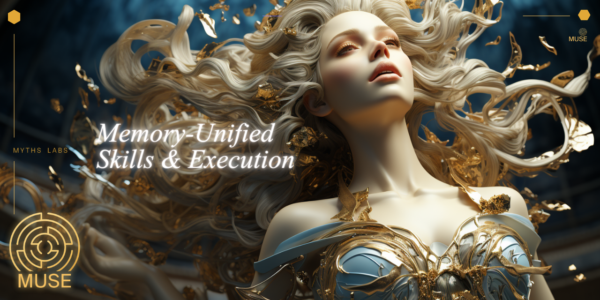
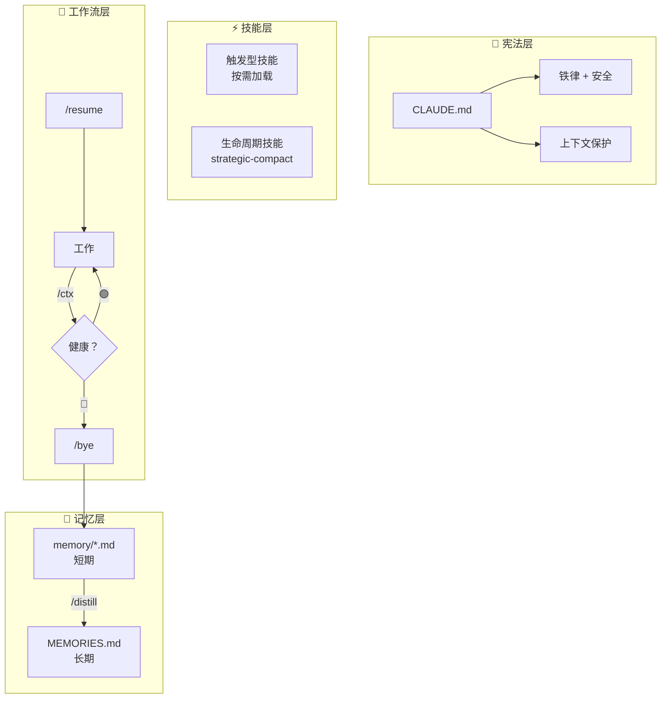

<p align="center">
  
</p>

# 🎭 MUSE（缪斯）

**Memory-Unified Skills & Execution**（记忆统一技能与执行）

<p align="center">

[](https://github.com/myths-labs/muse/blob/main/LICENSE)
[](https://github.com/myths-labs/muse/blob/main/CHANGELOG.md)
[](https://github.com/myths-labs/muse)
[](#)
[](#)

</p>

<p align="center">

[](https://x.com/MythsLabs)
[](https://linkedin.com/company/MythsLabs)
[](https://github.com/myths-labs)
[](https://x.com/sunshiningday)

</p>

> *希腊神话中九位缪斯女神是记忆女神 **Mnemosyne** 的女儿。她们将母亲的全知记忆化为对艺术与科学的精通。*
>
> *MUSE（缪斯）继承了这一血脉。它确保 AI 对话中的每一个洞见都不会丢失，将原始会话数据转化为驱动执行的结构化知识。*

MUSE（缪斯）是一套**纯 Markdown** 的 AI 编程协作操作系统。通过宪法、记忆层、技能库和执行工作流，实现 AI 编程助手的**跨对话无损上下文管理**。

灵感来源：[LCM（Lossless Context Management）](https://papers.voltropy.com/LCM) 论文 + [lossless-claw](https://github.com/Martian-Engineering/lossless-claw) 插件。MUSE（缪斯）用**纯 Markdown SOP**（而非代码插件）实现了 LCM 的核心设计思想。

[📖 English Docs](./README.md)

---

## ✨ 为什么需要 MUSE（缪斯）？

| 没有 MUSE（缪斯） | 有 MUSE（缪斯） |
|---------|--------|
| 长对话后 AI 忘记早期内容 | Pre/Post Compaction 协议保护关键信息 |
| 新对话要手动交代背景 | `/resume` 5 步自动组装上下文 |
| 结束对话忘记保存进度 | `/bye` 零输入一键收尾 |
| 跨天任务断档 | `grep memory/` 自动搜索历史 |
| 同样的坑踩两遍 | `/distill` 蒸馏教训到长期记忆 |

**支持工具**: Claude Code · OpenClaw · Cursor · Windsurf · Gemini CLI · Codex CLI — 以及任何支持 system prompt 的 AI 编程助手。

| 工具 | 安装命令 | 格式 |
|------|---------|------|
| Claude Code / OpenClaw | `./scripts/install.sh --tool claude` | `.agent/skills/` + `CLAUDE.md` |
| Cursor | `./scripts/install.sh --tool cursor` | `.cursor/rules/*.mdc` |
| Windsurf | `./scripts/install.sh --tool windsurf` | `.windsurf/rules/*.md` |
| Gemini CLI | `./scripts/install.sh --tool gemini` | `.gemini/skills/` + `GEMINI.md` |
| Codex CLI | `./scripts/install.sh --tool codex` | `AGENTS.md`（单文件） |

**推荐搭档**: [**nah**](https://github.com/manuelscgipper/nah) — Claude Code 的上下文感知权限守卫。确定性分类器自动放行安全操作、拦截危险模式（如 `curl | bash`），告别权限疲劳。`pip install nah && nah install`

---

## 🚀 快速上手（5 分钟）

### 方式一：交互式安装

```bash
git clone https://github.com/myths-labs/muse.git && cd muse && ./setup.sh
```

### 方式二：多工具安装（Cursor / Windsurf / Gemini CLI / Codex CLI）

```bash
git clone https://github.com/myths-labs/muse.git
cd muse && ./scripts/install.sh --tool cursor --target /path/to/your-project

# 或自动检测已安装的工具
./scripts/install.sh --target /path/to/your-project
```

支持: `claude`, `openclaw`, `cursor`, `windsurf`, `gemini`, `codex`, 或 `all`。

### 方式三：手动复制

```bash
# 克隆 MUSE（缪斯）
git clone https://github.com/myths-labs/muse.git

# 复制模板到你的项目
cp muse/templates/CLAUDE.md 你的项目/CLAUDE.md
cp muse/templates/USER.md 你的项目/USER.md
cp muse/templates/MEMORIES.md 你的项目/MEMORIES.md
mkdir -p 你的项目/memory 你的项目/.muse

# 复制技能和工作流
cp -r muse/skills 你的项目/.agent/skills
cp -r muse/workflows 你的项目/.agent/workflows

# 添加 MUSE（缪斯）条目到 .gitignore
cat muse/templates/.gitignore-template >> 你的项目/.gitignore
```

### 开始使用

```
你: /resume           ← AI 自动读宪法 → 读 memory → 开始工作
    ... 工作 ...
你: /ctx              ← 查上下文还够不够
    ... 继续工作 ...
你: /bye              ← 一键收尾，自动保存
```

---

## 🏗 架构



### LCM 概念映射

| LCM 概念 | MUSE（缪斯）实现 | 说明 |
|---------|----------|------|
| SQLite 持久化 | `memory/` + `MEMORIES.md` | Markdown 即数据库 |
| 叶子节点 | `memory/YYYY-MM-DD.md` | 每日对话快照 |
| 浓缩节点 | `MEMORIES.md` | 跨天蒸馏的教训 |
| 浓缩操作 | `/distill` | 叶子 → 长期记忆 |
| 组装器 | `/resume` | 上下文组装 |
| lcm_grep | `grep_search memory/` | 深度历史搜索 |
| compact:before | Pre-Compaction Protocol | 压缩前保存 |
| contextThreshold | `/ctx` 80% 红线 | 自动健康检查 |

---

## 📖 核心命令

| 命令 | 说明 | 输入 |
|------|------|:----:|
| `/start` | 首次配置 — 设置项目、角色、语言 | 无需（交互式） |
| `/resume [scope]` | 启动 — 恢复上下文 | `build`、`growth` 等 |
| `/settings` | 切换语言、模型、偏好设置 | 子命令（可选） |
| `/ctx` | 上下文健康检查（🟢🟡🔴） | 无需输入 |
| `/bye` | 零输入一键收尾 | 无需输入 |
| `/distill` | 蒸馏 memory/ → MEMORIES.md | 无需输入 |
| `/sync [方向]` | 多角色跨文件同步 | 方向（可选） |
| `/sync receive` | 对话中拉取其他角色的更新 | 无需输入 |
| `/resume [项目] qa` | 启动 QA 验证（独立于 build） | 项目名（可选） |
| `/resume crash` | 上下文爆掉后恢复 | 无需输入 |

### 防御式自动保存（L0 防御）

每 **10 轮交互** 静默更新 `memory/CRASH_CONTEXT.md`。突然爆掉最多丢 10 轮。

| 层级 | 触发 | 可靠性 |
|:----:|------|:------:|
| L0 | 每 10 轮（静默） | ⭐⭐⭐ |
| L1 | 🔴 上下文检测 | ⭐⭐ |
| L2 | `/resume crash` 扫描 `convo/` | ⭐ |

### 自动蒸馏提醒

每次 `/bye` 自动检查 memory/ 积累量，满足以下条件时提醒 `/distill`：
- ≥ 7 天未蒸馏日志
- 距上次 distill ≥ 5 个文件
- 总文件 ≥ 15 且从未 distill

---

## 🧩 技能体系

### 加载行为

| 类型 | 何时加载 | 示例 |
|------|---------|------|
| **始终开启** | 每轮自动 | `CLAUDE.md` 铁律、安全 |
| **触发型** | 任务匹配时 | `git-commit`、`systematic-debugging` |
| **生命周期** | 特定事件时 | `strategic-compact`（压缩）、`verification`（完成验证） |

### 分级

| 层级 | 说明 | 随 MUSE（缪斯）发布？ | 示例 |
|:----:|------|:-------------:|------|
| **🏛 Core** | MUSE（缪斯）运转必须 | ✅ 内置 | `context-health-check`、`strategic-compact`、`verification-before-completion`、`using-superpowers` |
| **🔧 Toolkit** | 通用开发工具 | ✅ 推荐 | `git-commit`、`systematic-debugging`、`security-review`、`tdd-workflow`、`frontend-design`、`ui-ux-pro-max` 等 25 个 |
| **🎯 Domain** | 用户自建领域技能 | ❌ 私密 | 你自己的定制技能 |

### 技能生命周期

```
memory/ 教训反复出现 → /distill 发现模式 → 写入 MEMORIES.md
→ 出现 ≥3 次 → 升级为 CLAUDE.md 宪法规则
→ 方法论足够通用 → 创建新 Skill
→ 跨项目有用 → 贡献到 MUSE（缪斯）Toolkit
```

---

## 📁 目录规范

### 标准项目结构

```
project/
├── CLAUDE.md              # 📜 宪法
├── USER.md                # 偏好（私密）
├── MEMORIES.md            # 长期记忆（私密）
├── assets/                # 🎨 项目资产
│   ├── logo.png / banner.png
│   ├── screenshots/ / diagrams/ / social/
├── .muse/                 # 🎭 角色状态（私密）
│   ├── build.md / qa.md / growth.md / ...
├── memory/                # 短期记忆（私密）
│   └── YYYY-MM-DD.md
├── convo/                 # 对话存档（私密）
│   └── YYMMDD/
├── .agent/                # 技能 + 工作流（私密）
│   ├── skills/ / workflows/
└── src/                   # 源代码
```

### 命名规范

| 分类 | 规则 | 示例 |
|------|------|------|
| 记忆日志 | `YYYY-MM-DD.md` | `2026-03-12.md` |
| 对话存档 | `YYMMDD-NN-desc.md` | `260312-02-setup.md` |
| 崩溃存档 | `+_CRASH` 后缀 | `260312-05-debug_CRASH.md` |
| 角色文件 | `[role].md` 小写 | `build.md`、`qa.md` |

---

## 🔧 定制化

### 最小配置（个人项目）

3 样东西即可启动：
- `CLAUDE.md` — 宪法（必须）
- `memory/` — 短期记忆（必须）
- `MEMORIES.md` — 长期记忆（推荐）

### 标准配置（独立开发者）

加上角色系统：
- `.muse/build.md` — 开发状态
- `.muse/qa.md` — 质量验证
- `USER.md` — 个人偏好

### 完整配置（团队/多项目）

加上 GM + 所有角色 + 同步：
- `.muse/strategy.md` — 战略（全局，workspace 层一份）
- `.muse/gm.md` — 项目 GM（项目级 CEO）
- `.muse/build.md` + `qa.md` + `growth.md` + `ops.md` + `research.md` + `fundraise.md`
- `/sync` 工作流 — 跨角色同步

---

## 🤔 FAQ

**Q: MUSE（缪斯）需要安装吗？**
不需要。MUSE（缪斯）是纯 Markdown 文件。复制到你的项目即可使用。零依赖。

**Q: 支持哪些 AI 工具？**
六种工具原生安装支持：**Claude Code**、**OpenClaw**、**Cursor**、**Windsurf**、**Gemini CLI** 和 **Codex CLI**。运行 `./scripts/install.sh --tool <工具名>` 自动转换为对应格式安装。其他支持 Markdown 规则文件的工具也可手动配置。

**Q: 和 lossless-claw 有什么区别？**
lossless-claw 是代码插件（SQLite + DAG + 子代理），依赖 OpenClaw 运行时。MUSE（缪斯）是纯 Markdown SOP，适用于任何 AI 工具，零依赖。相同理念，不同实现。

**Q: memory/ 文件堆太多怎么办？**
超过 30 天的文件归档到 `memory/archive/`。先用 `/distill` 提取关键教训到 `MEMORIES.md`，然后安全归档源文件。

---

## 💬 关注我们

- 🌐 GitHub: [Myths Labs](https://github.com/myths-labs)
- 🐦 X (Twitter): [@MythsLabs](https://x.com/MythsLabs)
- 💼 LinkedIn: [Myths Labs](https://linkedin.com/company/MythsLabs)
- 👤 创始人: [@SunshiningDay](https://x.com/sunshiningday) — 独立开发者，一人全栈构建 MUSE（缪斯）

---

## 🙏 致谢

- [LCM Paper](https://papers.voltropy.com/LCM) by Ehrlich & Blackman — 无损上下文管理的理论基础
- [lossless-claw](https://github.com/Martian-Engineering/lossless-claw) by Martian Engineering — LCM 的 OpenClaw 实现
- [nah](https://github.com/manuelscgipper/nah) by Manuel Schipper — 上下文感知权限守卫（与 MUSE 安全协议互补）
- 希腊神话 — 记忆女神 Mnemosyne 和她的九位缪斯女儿，记忆与创造的永恒象征

---

## 📜 License

MIT © [Myths Labs](https://github.com/myths-labs)

---

<p align="center">
  Built with 🎭 by <a href="https://github.com/myths-labs">Myths Labs</a> — Solo-developed by <a href="https://github.com/jc-myths">JC</a>
</p>

<p align="center">
  <i>MUSE v2.8.1</i>
</p>
